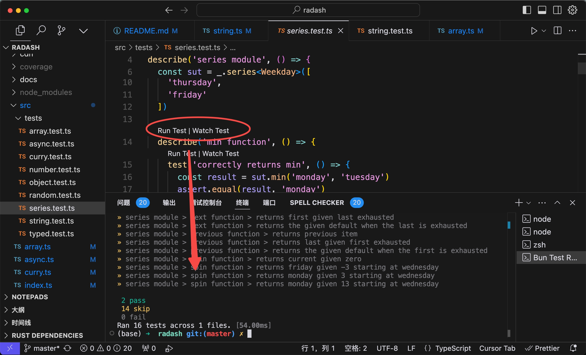
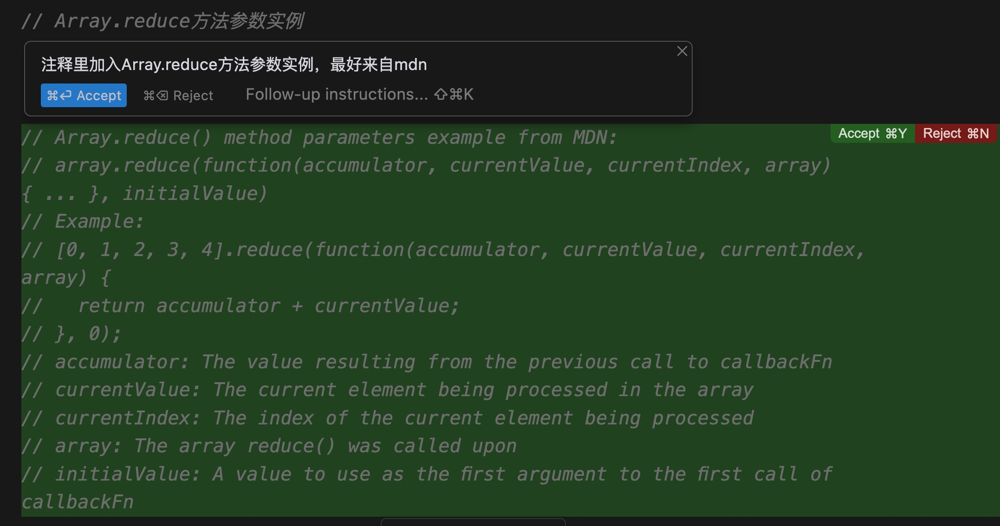

# 使用Cursor读Radash源码


lodash过时了，参考[You-Dont-Need-Lodash-Underscore](https://github.com/you-dont-need/You-Dont-Need-Lodash-Underscore)。其实原因很简单，主要是es native新语法更新导致的。虽然native可以实现，但有时候还是希望简单一点，又不想用lodash所有api，Radash是一个很好的选择。

Radash 是一个现代化的工具库，旨在为 lodash 提供一个更加现代的替代方案。它注重可读性和易用性，提供了诸如 tryit 和 retry 等多种实用函数。Radash 最突出的特点之一是，它的大多数函数都可以直接复制到你的项目中使用，无需安装，这使得它对寻求快速解决方案的开发者来说非常方便。

该库在设计时充分考虑了现代 JavaScript 特性，确保充分利用 ES 模块和 TypeScript 支持。这使得 Radash 不仅轻量级，而且与现代开发实践高度兼容。它的函数式编程风格鼓励不可变性和纯函数，这可以带来更清晰、更易维护的代码。

非要吹毛求疵，也能找一点确定

- 比lodash少了非常多api，比如unique这种常见面试题，它也没有实现
- crush&construct等api略怪
- 最近1年更新基本没有，没有radashi活跃。


## 代码解释

对于string里的camel方法实现。

- 可选链操作符 (?.) 用于安全地访问可能为 null/undefined 的值的属性或调用其方法
- 空值合并操作符 (??) 在左侧值为 null/undefined 时提供默认值 []

很明显这是最佳实践，但Cursor并没有解读。这不算错误，只是一些细节，对于一些人很重要。基础如果不牢，读代码还是挺不容易的。

```
export const camel = (str: string): string => {
  // Optional chaining (?.) operator is used to safely access properties or call methods on potentially null/undefined values
  // If str is null/undefined, the chain will short-circuit and return undefined
  // 可选链操作符 (?.) 用于安全地访问可能为 null/undefined 的值的属性或调用其方法
  // 如果 str 为 null/undefined，则链式调用会中断并返回 undefined

  // Nullish coalescing operator (??) provides a default value [] when the left side is null/undefined
  // 空值合并操作符 (??) 在左侧值为 null/undefined 时提供默认值 []

  // 这里?.和??搭配是非常好的写法。
  const parts =
    str
      ?.replace(/([A-Z])+/g, capitalize)
      ?.split(/(?=[A-Z])|[\.\-\s_]/)
      .map(x => x.toLowerCase()) ?? []

  // Handle edge cases
  // 处理边界情况
  if (parts.length === 0) return ''
  if (parts.length === 1) return parts[0]

  // Combine parts in camelCase format
  // 以驼峰格式组合各部分
  return parts.reduce((acc, part) => {
    return `${acc}${part.charAt(0).toUpperCase()}${part.slice(1)}`
  })
}
```


## 执行Cli

由于src下有多个文件，为了简单

```
$ npm test -- string.test.ts
```

我自己比较喜欢这样用。然后我问了一下cursor，竟然也有类似的方案，大意一样。


## test only


## 生成cmd

还有就是我非常习惯用cmd + k来清理terminal的信息，它是用cmd + k来生成cmd。


非常难受的是终端显示和隐藏快捷键control + ~。

## 直接bun执行测试



## 生成测试代码

生成代码，如果需要cmd  + k改成其他方法也行。


除了ts-node直接执行外，还有ts-node-dev，这个我之前没用过，学了一点。


## 重构ts不太行，问答类型还可以

比如assign的返回值，几次尝试返回值类型都没对，需要问答之后手动修改。


## 加个文档



如果熟悉https://developer.mozilla.org/zh-CN/docs/Web/JavaScript/Reference/Global_Objects/Array/reduce，对比生成的内容，可以非常快的理解。


## 总结


关于编辑器，新手引导welcome功能设计的还行，就是chat with codebase不好找，首先cmd + l进入chat窗口，输入内容后，enter是当前文件，cmd + enter是基于codebase做的处理。交互没问题，但引导设计的不舒服。

Cursor用法总结：

1、要会问，不同问法它的结果是不一样的。
2、要会挑适合自己的答案。
3、重复操作，每次都要和chat聊，很烦。
4、随时写小demo是真的爽，比如某个api不确定的时候。

对人而言

1. 新人上手容易了
2. 有经验的人提效明显
3. 学习的人变简单了

总结：新人和高手二级分化严重，整体难度有所降低，行业变革会比较大。


# Radash

:loud_sound: `/raw-dash/`

<div align="center">
  <p align="center">
    
  </p>
</div>

<div>
  <h3 align="center">
    函数式工具库 - 现代、简单、类型安全、功能强大
  </h3>
</div>

<p align="center">
  <a href="https://bundlephobia.com/package/radash">
    
  </a>
  <a href="https://www.npmjs.com/package/radash">
    
  </a>
  <a href="https://www.npmjs.com/package/radash">
    
  </a>
  <a href="https://github.com/rayepps/radash">
    
  </a>
</p>

<div align="center">
  <a href="https://radash-docs.vercel.app" target="_blank">
      完整文档
  </a>
</div>


Radash 是一个现代化的工具库，旨在为 lodash 提供一个更加现代的替代方案。它注重可读性和易用性，提供了诸如 tryit 和 retry 等多种实用函数。Radash 最突出的特点之一是，它的大多数函数都可以直接复制到你的项目中使用，无需安装，这使得它对寻求快速解决方案的开发者来说非常方便。

该库在设计时充分考虑了现代 JavaScript 特性，确保充分利用 ES 模块和 TypeScript 支持。这使得 Radash 不仅轻量级，而且与现代开发实践高度兼容。它的函数式编程风格鼓励不可变性和纯函数，这可以带来更清晰、更易维护的代码。

## 安装

```
yarn add radash
```

## 使用方法

以下是一个简要的使用示例。完整文档请查看[这里](https://radash-docs.vercel.app)。

```ts
import * as _ from 'radash'

const gods = [{
  name: 'Ra',
  power: 'sun',
  rank: 100,
  culture: 'egypt'
}, {
  name: 'Loki',
  power: 'tricks',
  rank: 72,
  culture: 'norse'
}, {
  name: 'Zeus',
  power: 'lightning',
  rank: 96,
  culture: 'greek'
}]

_.max(gods, g => g.rank) // => ra
_.sum(gods, g => g.rank) // => 268
_.fork(gods, g => g.culture === 'norse') // => [[loki], [ra, zeus]]
_.sort(gods, g => g.rank) // => [ra, zeus, loki]
_.boil(gods, (a, b) => a.rank > b.rank ? a : b) // => ra

_.objectify(
  gods,
  g => g.name.toLowerCase(),
  g => _.pick(g, ['power', 'rank', 'culture'])
) // => { ra, zeus, loki }

const godName = _.get(gods, g => g[0].name)

const [err, god] = await _.try(api.gods.findByName)(godName)

const allGods = await _.map(gods, async ({ name }) => {
  return api.gods.findByName(name)
})
```

## 贡献

欢迎并感谢您的贡献！在开始之前，请查看[贡献指南](./.github/contributing.md)。
